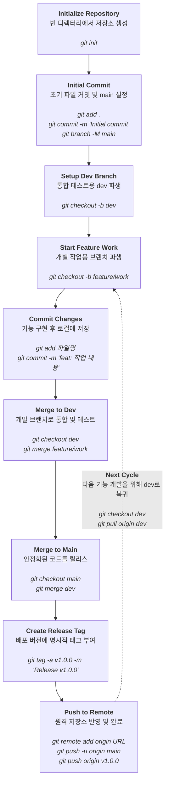

# Git Basic Workflow (기본 워크플로우)

이 문서는 프로젝트를 처음 시작하고, 기능 개발 및 테스트를 거쳐 GitHub에 릴리스하기까지의 **가장 표준적이고 전문적인 Git 워크플로우**를 다룹니다.

## 📌 워크플로우 다이어그램

각 박스는 **액션 + 설명 + Git 명령어**로 구성되어 있으며, 위에서 아래로 내려오는 진행 흐름과 배포 후 다시 새로운 개발을 위해 순환하는 사이클을 보여줍니다. `feature/work` 브랜치는 반드시 `dev` 브랜치에 병합되어 테스트를 거친 후, 최종적으로 `main` 브랜치로 반영됩니다.



---

## 📝 단계별 상세 가이드 및 명령어

위 다이어그램의 각 단계를 수행하기 위한 구체적인 설명입니다.

### 1️⃣ 저장소 초기화 (`Initialize Repository`)
새로운 프로젝트 폴더를 만들고 Git 통제를 시작합니다.
```bash
git init
```

### 2️⃣ 초기 커밋 & `main` 브랜치 설정 (`Initial Commit`)
기반 코드를 작성한 후 커밋하고, 기본 브랜치 이름을 `main`으로 설정합니다.
```bash
git add .
git commit -m "chore: initial commit"
git branch -M main
```

### 3️⃣ 개발 환경 분리 (`Setup Dev Branch`)
안정적인 상용 배포용 `main` 브랜치를 온전히 보호하기 위해, 모든 기능이 모여 테스트될 `dev` 브랜치를 만듭니다.
```bash
git checkout -b dev
```

### 4️⃣ 기능 개발 시작 (`Start Feature Work`)
특정 기능(feature)을 개발하거나 버그를 수정하기 위해 `dev`로부터 작업용 브랜치를 파생시킵니다.
```bash
git checkout -b feature/login
```

### 5️⃣ 작업 후 커밋 (`Commit Changes`)
코드를 수정하고 기능을 단위별로 논리적으로 쪼개어 커밋합니다.
```bash
git add login_module.py
git commit -m "feat: login UI 구현 완료"
```

### 6️⃣ 코드를 `dev`로 병합 (테스트 환경) (`Merge to Dev`)
기능 개발이 완료되면 `dev` 브랜치로 먼저 병합합니다. 이곳에서 다른 작업자들의 코드와 충돌이 없는지, 전체 시스템이 잘 동작하는지 **통합 테스트**를 진행합니다.
```bash
# dev 브랜치로 이동
git checkout dev

# 작업했던 브랜치를 가져와서 병합
git merge feature/login
```

### 7️⃣ 코드를 `main`으로 병합 (실제 배포) (`Merge to Main`)
`dev` 브랜치에서 충분한 테스트를 거치고 안정성이 검증되면, 비로소 `main` 브랜치에 병합하여 운영 서버에 배포할 준비를 합니다.
```bash
git checkout main
git merge dev
```

### 8️⃣ 버전 태그 달기 (`Create Release Tag`)
릴리스할 `main` 브랜치의 커밋에 명시적인 버전 정보(예: `v1.0.0`)를 기록해 히스토리 관리를 투명하게 유지합니다.
```bash
# 커밋에 상세 메시지가 포함된 태그 추가 (Annotated tag)
git tag -a v1.0.0 -m "Release version 1.0.0"
```

### 9️⃣ 원격 저장소(GitHub)로 내보내기 (`Push to Remote`)
이제 완성된 로컬 저장소의 브랜치와 태그를 GitHub 서버에 업로드하여 팀원들과 공유합니다.
```bash
# 원격 저장소(origin) 주소 추가 (초기 설정 시 1회만 필요)
git remote add origin https://github.com/사용자명/저장소명.git

# main 브랜치 푸시
git push -u origin main
# 별도로 태그 푸시
git push origin v1.0.0
```
