# Git Intermediate Workflow (중급 트러블슈팅 가이드)

프로젝트를 진행하다 보면 파일 수정, 커밋 실수, 잘못된 브랜치 병합 등 수많은 "아차!" 하는 순간을 마주하게 됩니다.
본 가이드는 초보자가 가장 흔하게 겪는 **문제 상황 30가지**를 해결하고 **수정·원복·폐기** 등을 수행하는 **실전 Git Action 명령어**를 다룹니다.

## 📌 상태-액션 매핑 다이어그램 (State-Action Graph)

이 다이어그램은 철저히 **상태(원형 박스)**와 그 상태 간의 이동을 유도하는 **액션(사각 박스)**으로 나뉘어 있습니다.
사용자의 요청에 따라, 하단에 설명된 **1번부터 30번까지의 모든 위기 탈출 상황이 각각 독립된 30개의 액션 박스로 완전히 개별 매핑**되어 있습니다. (각 박스에는 기능 이름 / 설명 / 명령어 요약이 들어있습니다)

```mermaid
graph TD
    %% =======================
    %% 🔵 상태(States) 노드 정의
    %% =======================
    S_UNMOD(((<b>Unmodified</b><br/>수정 없음)))
    S_MOD(((<b>Modified</b><br/>파일 수정됨)))
    S_STG(((<b>Staged</b><br/>커밋 대기중)))
    S_COM(((<b>Committed</b><br/>로컬 커밋됨)))
    S_REM(((<b>Pushed</b><br/>원격에 올라감)))
    S_STASH(((<b>Stashed</b><br/>임시 보관됨)))

    %% =======================
    %% 🟩 30가지 개별 액션(Actions) 정의
    %% =======================
    
    %% 1. 스테이징 & 작업 영역
    A1["<b>1. Restore</b><br/>파일 상태 복구<br/><i>git restore</i>"]
    A2["<b>2. Clean</b><br/>미추적 삭제<br/><i>git clean -fd</i>"]
    A3["<b>3. Unstage File</b><br/>특정 파일 내리기<br/><i>git restore --staged</i>"]
    A4["<b>4. Unstage All</b><br/>전부 내리기<br/><i>git reset</i>"]
    A5["<b>5. Checkout HEAD</b><br/>마지막 커밋 복구<br/><i>git checkout HEAD</i>"]

    %% 2. 커밋 실수 수습
    A6["<b>6. Amend Msg</b><br/>메시지 수정<br/><i>git commit --amend</i>"]
    A7["<b>7. Amend Add</b><br/>누락 파일 추가<br/><i>git commit --amend</i>"]
    A8["<b>8. Soft Reset</b><br/>커밋만 취소<br/><i>git reset --soft</i>"]
    A9["<b>9. Mixed Reset</b><br/>커밋+Add 취소<br/><i>git reset HEAD</i>"]
    A10["<b>10. Hard Reset</b><br/>완전 다 버림<br/><i>git reset --hard</i>"]
    A11["<b>11. Revert</b><br/>원격 푸시 되돌림<br/><i>git revert</i>"]

    %% 3. 브랜치 병합 및 충돌
    A12["<b>12. Rename Branch</b><br/>브랜치명 변경<br/><i>git branch -m</i>"]
    A13["<b>13. Delete Branch</b><br/>로컬 브랜치 삭제<br/><i>git branch -d</i>"]
    A14["<b>14. Prune</b><br/>원격 브랜치 청소<br/><i>git fetch -p</i>"]
    A15["<b>15. Branch Late</b><br/>뒤늦게 브랜치 파생<br/><i>git checkout -b</i>"]
    A16["<b>16. Cherry-Pick</b><br/>특정 커밋 가져오기<br/><i>git cherry-pick</i>"]
    A17["<b>17. Merge Abort</b><br/>병합 취소<br/><i>git merge --abort</i>"]
    A18["<b>18. Resolve Merge</b><br/>충돌 해결 후 병합<br/><i>git commit</i>"]
    A19["<b>19. Hard Reset Origin</b><br/>서버와 완전 동기화<br/><i>git reset --hard origin</i>"]

    %% 4. 임시 공간 (Stash)
    A20["<b>20. Stash Save</b><br/>작업 임시 보관<br/><i>git stash save</i>"]
    A21["<b>21. Stash Pop</b><br/>작업 다시 꺼내오기<br/><i>git stash pop</i>"]
    A22["<b>22. Stash List</b><br/>보관 목록 보기<br/><i>git stash list</i>"]
    A23["<b>23. Stash Clear</b><br/>보관소 비우기<br/><i>git stash clear</i>"]

    %% 5. 캐시 및 무시
    A24["<b>24. RM Cached</b><br/>추적에서만 빼기<br/><i>git rm --cached</i>"]
    A25["<b>25. Ignore Case</b><br/>대소문자 무시 취소<br/><i>git config</i>"]
    A26["<b>26. Rebase -i</b><br/>다수 커밋 합치기<br/><i>git rebase -i</i>"]

    %% 6. 원격 계정 및 기적의 복구
    A27["<b>27. Amend Author</b><br/>작성자 정보 변경<br/><i>git commit --amend</i>"]
    A28["<b>28. Set URL</b><br/>원격 주소 변경<br/><i>git remote set-url</i>"]
    A29["<b>29. Show</b><br/>과거 내용 확인<br/><i>git show</i>"]
    A30["<b>30. Reflog</b><br/>해시 강제 복원<br/><i>git reflog</i>"]


    %% =======================
    %% ➡️ 상태 -> 액션 -> 상태 흐름
    %% =======================
    
    %% 정방향 트리거 (설명용 가짜 액션은 생략하고 번호 매핑 위주로 구성)
    
    %% 카테고리 1
    S_MOD --> A1 --> S_UNMOD
    S_MOD --> A2 --> S_UNMOD
    S_STG --> A3 --> S_MOD
    S_STG --> A4 --> S_MOD
    S_MOD --> A5 --> S_UNMOD
    
    %% 카테고리 2
    S_COM --> A8 --> S_STG
    S_COM --> A9 --> S_MOD
    S_COM --> A10 --> S_UNMOD
    S_REM --> A11 --> S_COM
    
    %% 상태 루프
    S_COM --> A6 --> S_COM
    S_COM --> A7 --> S_COM
    S_COM --> A12 --> S_COM
    S_COM --> A13 --> S_UNMOD
    S_REM --> A14 --> S_REM
    S_MOD --> A15 --> S_MOD
    S_COM --> A16 --> S_COM
    S_MOD --> A17 --> S_UNMOD
    S_MOD --> A18 --> S_COM
    S_COM --> A19 --> S_REM
    
    %% 카테고리 4 (Stash)
    S_MOD --> A20 --> S_STASH
    S_STASH --> A21 --> S_MOD
    S_STASH --> A22 --> S_STASH
    S_STASH --> A23 --> S_UNMOD
    
    %% 카테고리 5 & 6
    S_COM --> A24 --> S_MOD
    S_MOD --> A25 --> S_MOD
    S_COM --> A26 --> S_COM
    S_COM --> A27 --> S_COM
    S_REM --> A28 --> S_REM
    S_COM --> A29 --> S_COM
    
    %% 최후의 보루
    S_UNMOD -.-> A30 -.-> S_COM

    %% =======================
    %% 🎨 스타일 정의
    %% =======================
    classDef state fill:#ebf5fb,stroke:#2980b9,stroke-width:3px,color:#2c3e50
    classDef action fill:#fdfefe,stroke:#7f8c8d,stroke-width:2px,stroke-dasharray: 5 5,color:#34495e
    classDef dangerAction fill:#fdedec,stroke:#c0392b,stroke-width:2px,color:#922b21

    %% 클래스 부여
    class S_UNMOD,S_MOD,S_STG,S_COM,S_REM,S_STASH state
    
    %% 위험한 액션 강조 (Hard Reset, Clean 등)
    class A1,A2,A10,A17,A19,A23,A24 dangerAction
    
    %% 기본 액션들
    class A3,A4,A5,A6,A7,A8,A9,A11,A12,A13,A14,A15,A16,A18,A20,A21,A22,A25,A26,A27,A28,A29,A30 action
```



---

## 📝 상황별 위기 탈출 30선

실제 상황에 맞춰 즉시 복사해서 사용할 수 있는 해결 가이드입니다. (위의 다이어그램 상단 액션의 번호와 매칭됩니다)

### 🛡️ 1. 스테이징 & 작업 영역 (파일 단계별 복구)
**1️⃣ 방금 수정한 파일 내용을 수정 전으로 아예 복구하기**
```bash
git restore <파일명>
```

**2️⃣ 새로 만들었지만 필요 없어진 파일(Untracked) 한 번에 지우기**
```bash
git clean -fd
```

**3️⃣ 실수로 `git add` 한 파일 다시 작업 영역으로 내리기 (Unstage)**
```bash
git restore --staged <파일명>
```

**4️⃣ `git add .` 으로 올라간 파일들 모두 한 번에 내리기**
```bash
git reset
```

**5️⃣ 특정 파일만 가장 마지막 커밋 상태로 돌려놓기 (수정분 폐기)**
```bash
git checkout HEAD -- <파일명>
```

---

### ⏪ 2. 커밋 실수 수습하기 (리셋과 수정)
**6️⃣ 방금 짠 커밋의 '메시지'만 쏙 바꾸기**
```bash
git commit --amend -m "수정할 새로운 커밋 메시지"
```

**7️⃣ 방금 한 커밋에 깜빡 잊은 파일 추가로 욱여넣기**
```bash
git add <깜빡한-파일>
git commit --amend --no-edit
```

**8️⃣ 방금 한 커밋 취소하기 (수정된 코드와 Add 상태는 모두 살려둠)**
```bash
git reset --soft HEAD~1
```

**9️⃣ 방금 한 커밋 취소하고 Add도 내리기 (수정된 코드만 살려둠)**
```bash
git reset HEAD~1
```

**🔟 방금 한 커밋 취소하고 수정한 파일까지 완전히 휴지통에 버리기 (위험!)**
```bash
git reset --hard HEAD~1
```

**1️⃣1️⃣ 이미 GitHub에 올려버린(Push) 커밋을 되돌려야 할 때 (Revert)**
```bash
git revert <되돌릴-커밋해시>
git push
```

---

### 🌿 3. 브랜치 병합 및 충돌 해결
**1️⃣2️⃣ 로컬에서 딴 현재 브랜치 이름 변경하기**
```bash
git branch -m <새로운-브랜치명>
```

**1️⃣3️⃣ 작업 끝나고 필요 없어진 로컬 브랜치 삭제하기**
```bash
git branch -d <삭제할-브랜치명>
```

**1️⃣4️⃣ 원격(GitHub)에서 지워진 브랜치들 내 로컬 리스트에서도 싹 지우기 (동기화)**
```bash
git fetch -p
```

**1️⃣5️⃣ 실수로 `main`에서 수정 중이었는데, 뒤늦게 브랜치 파생시키기**
```bash
git checkout -b <새로운_브랜치명>
```

**1️⃣6️⃣ 실수로 A 브랜치에 해야 할 커밋을 B 브랜치에 했을 때 쏙 빼오기 (Cherry-Pick)**
```bash
git checkout A
git cherry-pick <복사한-커밋해시>
```

**1️⃣7️⃣ 남의 브랜치와 Merge 하다가 큰 충돌이 나서 그냥 병합 자체를 포기할 때**
```bash
git merge --abort
```

**1️⃣8️⃣ 병합 중 충돌(Conflict)이 나서 코드를 수정한 뒤 다시 병합 이어가기**
```bash
git add <충돌-해결한-파일명>
git commit
```

**1️⃣9️⃣ 내 로컬 수정본 이딴 거 다 버리고 그냥 100% 원격 서버랑 똑같이 덮어쓰기**
```bash
git fetch origin
git reset --hard origin/<브랜치명>
```

---

### 💼 4. 작업 임시 공간 (Stash) 활용하기
**2️⃣0️⃣ 작업 중에 긴급하게 브랜치를 넘어가야 하는데 커밋하기 애매할 때 (보관)**
```bash
git stash save "login 화면 CSS 수정하다 말았음"
```

**2️⃣1️⃣ 급한 불 끄고 돌아와서 저장해둔 임시 작업(Stash) 꺼내 쓰기**
```bash
git stash pop
```

**2️⃣2️⃣ 현재 보관되어 있는 임시 작업 리스트들 조회하기**
```bash
git stash list
```

**2️⃣3️⃣ 모아둔 임시 작업 목록 싹 다 비우기 (주의)**
```bash
git stash clear
```

---

### 🔍 5. 캐시, 추적, `.gitignore` 응급 처치
**2️⃣4️⃣ 이미 Git에 올라가 있던 파일을 뒤늦게 `.gitignore`에 넣었는데 계속 추적될 때**
```bash
git rm --cached <파일명>
```

**2️⃣5️⃣ 파일 이름의 '대소문자'만 바꿨더니 Git이 인식을 못 하고 무시할 때**
```bash
git config core.ignorecase false
```

**2️⃣6️⃣ 여러 커밋을 하나로 깔끔하게 묶고 싶을 때 (Interactive Rebase)**
```bash
git rebase -i HEAD~3
```

---

### 🔥 6. 원격 계정 및 기적의 복구
**2️⃣7️⃣ 방금 엉뚱한 이름이나 이메일로 커밋했을 때 작성자만 변경하기**
```bash
git commit --amend --author="사용자명 <email@domain.com>" --no-edit
```

**2️⃣8️⃣ 이 프로젝트의 잘못 연결된 원격 깃허브 주소(URL) 변경하기**
```bash
git remote set-url origin <새로운_레포지토리_URL>
```

**2️⃣9️⃣ 특정 파일 한 개만 수십 일 전 과거 버전 내용물로 확인하고 싶을 때**
```bash
git show <과거_커밋해시>:<해당_파일명>
```

**3️⃣0️⃣ 실수로 `git reset --hard`나 브랜치 강제 삭제로 코드를 아예 날려버렸을 때 (명줄 복구)**
```bash
git reflog
git reset --hard HEAD@{숫자}
```
