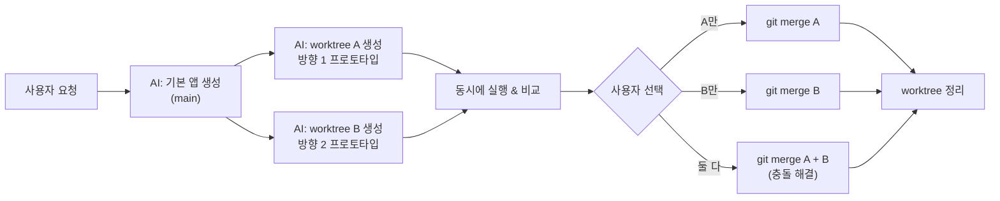

# Git Worktree 실습 가이드

AI가 git worktree를 활용하여 **병렬 개발 → 비교 → 선택적 병합**하는 전체 워크플로우를 단계별로 정리한 문서입니다.

---

## 목차

1. [프로젝트 초기화](#1-프로젝트-초기화)
2. [기본 앱 작성 & 커밋](#2-기본-앱-작성--커밋)
3. [Git Worktree 생성](#3-git-worktree-생성)
4. [각 Worktree에서 개발 & 커밋](#4-각-worktree에서-개발--커밋)
5. [Worktree 상태 확인](#5-worktree-상태-확인)
6. [3개의 앱 동시 실행 & 비교](#6-3개의-앱-동시-실행--비교)
7. [브랜치 병합](#7-브랜치-병합)
8. [충돌 해결](#8-충돌-해결)
9. [Worktree 정리](#9-worktree-정리)
10. [최종 확인](#10-최종-확인)

---

## 1. 프로젝트 초기화

```bash
# Git 저장소 초기화
git init

# 기본 브랜치를 main으로 설정
git branch -M main
```

> **설명**: 빈 디렉터리에서 새로운 git 저장소를 만듭니다.
> `git branch -M main`은 기본 브랜치 이름을 `main`으로 변경합니다. (`master` 대신)

---

## 2. 기본 앱 작성 & 커밋

```bash
# 파일 작성 후 (app.py, requirements.txt, .gitignore 등)

# 모든 파일을 스테이징
git add -A

# 첫 번째 커밋
git commit -m "feat: initial Streamlit sales dashboard app"
```

> **설명**: 기본 앱 코드를 작성하고 `main` 브랜치에 첫 커밋을 합니다.
> 이 커밋이 worktree들의 **공통 출발점(base)**이 됩니다.

이 시점의 git 히스토리:
```
* e311e03 (HEAD -> main) feat: initial Streamlit sales dashboard app
```

---

## 3. Git Worktree 생성

```bash
# Worktree A: 다크 테마 작업용
# -b feature/dark-theme  → 새 브랜치를 생성
# ../git-worktree-sample-dark-theme  → worktree가 생성될 디렉터리 경로
# main  → 어떤 커밋에서 분기할지 (시작점)
git worktree add -b feature/dark-theme ../git-worktree-sample-dark-theme main

# Worktree B: 분석 기능 작업용
git worktree add -b feature/analytics ../git-worktree-sample-analytics main
```

> **설명**: `git worktree add`는 **하나의 `.git` 저장소에서 여러 개의 작업 디렉터리를 만드는 명령**입니다.
>
> 일반적인 `git branch` + `git checkout`과의 차이점:
> | 방식 | 작업 디렉터리 | 동시 작업 |
> |------|-------------|----------|
> | `git checkout` | 1개 (브랜치 전환) | ❌ 한 번에 하나만 |
> | `git worktree` | 여러 개 (각각 독립) | ✅ 동시에 여러 브랜치 작업 |
>
> 즉, **브랜치를 전환하지 않고도** 여러 브랜치의 코드를 동시에 열어두고 작업할 수 있습니다.

### 명령어 구조

```
git worktree add [-b <새 브랜치명>] <디렉터리 경로> <시작 커밋/브랜치>
```

| 인자 | 역할 |
|------|------|
| `-b feature/dark-theme` | 새 브랜치를 생성하면서 worktree에 체크아웃 |
| `../git-worktree-sample-dark-theme` | worktree가 생성될 파일시스템 경로 |
| `main` | 이 브랜치/커밋에서 분기 시작 |

---

## 4. 각 Worktree에서 개발 & 커밋

```bash
# Worktree A (다크 테마): app.py 수정 후 커밋
# git -C <경로> : 해당 경로에서 git 명령 실행 (cd 없이)
git -C ../git-worktree-sample-dark-theme add -A
git -C ../git-worktree-sample-dark-theme commit -m "feat: add dark theme with neon glow effects"

# Worktree B (분석 강화): app.py + requirements.txt 수정 후 커밋
git -C ../git-worktree-sample-analytics add -A
git -C ../git-worktree-sample-analytics commit -m "feat: add interactive analytics with Plotly charts"
```

> **설명**: 각 worktree 디렉터리에서 독립적으로 파일을 수정하고 커밋합니다.
>
> `git -C <경로>`를 사용하면 **현재 디렉터리를 이동하지 않고도** 다른 worktree의 git 명령을 실행할 수 있습니다.
>
> 또는 직접 해당 디렉터리로 이동해서 작업해도 됩니다:
> ```bash
> cd ../git-worktree-sample-dark-theme
> git add -A
> git commit -m "feat: add dark theme with neon glow effects"
> ```

---

## 5. Worktree 상태 확인

```bash
# 현재 존재하는 모든 worktree 목록 확인
git worktree list
```

출력 결과:
```
/Users/.../git-worktree-sample              e311e03 [main]
/Users/.../git-worktree-sample-analytics    c32c75f [feature/analytics]
/Users/.../git-worktree-sample-dark-theme   f26ee3f [feature/dark-theme]
```

```bash
# 모든 브랜치의 커밋 그래프 확인
git log --all --graph --oneline
```

출력 결과:
```
* c32c75f (feature/analytics) feat: add interactive analytics with Plotly charts
| * f26ee3f (feature/dark-theme) feat: add dark theme with neon glow effects
|/
* e311e03 (HEAD -> main) feat: initial Streamlit sales dashboard app
```

---

## 6. 3개의 앱 동시 실행 & 비교

```bash
# main 브랜치의 앱 (포트 8501)
streamlit run app.py --server.port 8501 --server.headless true

# dark-theme worktree의 앱 (포트 8502)
streamlit run ../git-worktree-sample-dark-theme/app.py --server.port 8502 --server.headless true

# analytics worktree의 앱 (포트 8503)
streamlit run ../git-worktree-sample-analytics/app.py --server.port 8503 --server.headless true
```

> **설명**: 각 worktree의 코드가 별도의 디렉터리에 있으므로, **3개의 서버를 동시에 실행**할 수 있습니다.
> `compare.html`을 브라우저에서 열면 3개의 iframe으로 동시에 비교할 수 있습니다.
>
> 이것이 worktree의 핵심 장점입니다: **여러 버전을 동시에 실행하고 비교**할 수 있습니다.

---

## 7. 브랜치 병합

```bash
# main 브랜치에서 실행 (현재 main에 있는지 확인)
git branch
# * main

# 첫 번째 병합: dark-theme → main
git merge feature/dark-theme -m "merge: feature/dark-theme into main"
# 결과: Fast-forward (충돌 없음)
# main이 e311e03이고 dark-theme이 e311e03에서 분기했으므로 fast-forward됨
```

---

## 8. 충돌 해결

```bash
# 충돌 상태 확인
git status
# both modified: app.py

# 충돌 파일을 열어보면 다음과 같은 마커가 있음:
# <<<<<<< HEAD
# (dark-theme 버전의 코드)
# =======
# (analytics 버전의 코드)
# >>>>>>> feature/analytics

# 두 버전의 코드를 수동으로 합침 (양쪽 기능 모두 포함)
# → app.py 편집: 다크 테마 CSS + Plotly 차트 + 모든 필터 통합

# 충돌 해결 후 커밋
git add -A
git commit -m "merge: resolve conflict — combine dark-theme + analytics into ultimate edition"
```

---

## 9. Worktree 정리

```bash
# 더 이상 필요 없는 worktree 삭제
git worktree remove ../git-worktree-sample-dark-theme
git worktree remove ../git-worktree-sample-analytics

# 정리 후 확인
git worktree list
# /Users/.../git-worktree-sample  9c10199 [main]   ← main만 남음
```

---

## 10. 최종 확인

```bash
# 최종 브랜치 그래프 확인
git log --all --graph --oneline
```

출력 결과:
```
*   9c10199 (HEAD -> main) merge: resolve conflict — combine dark-theme + analytics
|\
| * c32c75f (feature/analytics) feat: add interactive analytics with Plotly charts
* | f26ee3f (feature/dark-theme) feat: add dark theme with neon glow effects
|/
* e311e03 feat: initial Streamlit sales dashboard app
```

---

## 빠른 참조: Git Worktree 명령어 모음

| 명령 | 설명 |
|------|------|
| `git worktree add -b <브랜치> <경로> <시작점>` | 새 브랜치 + worktree 생성 |
| `git worktree add <경로> <기존 브랜치>` | 기존 브랜치로 worktree 생성 |
| `git worktree list` | 모든 worktree 목록 확인 |
| `git worktree remove <경로>` | worktree 삭제 |
| `git worktree prune` | 유효하지 않은 worktree 참조 정리 |
| `git -C <경로> <명령>` | 특정 worktree에서 git 명령 실행 |

---

## AI 활용 시나리오



> AI가 여러 방향의 프로토타입을 **동시에** 생성하고, 사용자가 비교 후 선택하는 워크플로우에 git worktree가 적합합니다.
