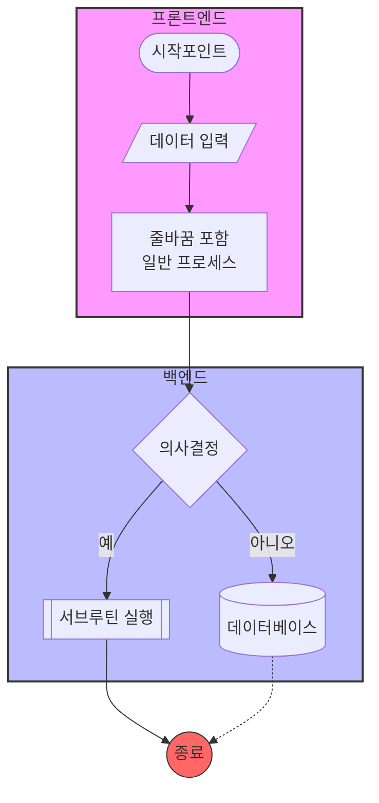
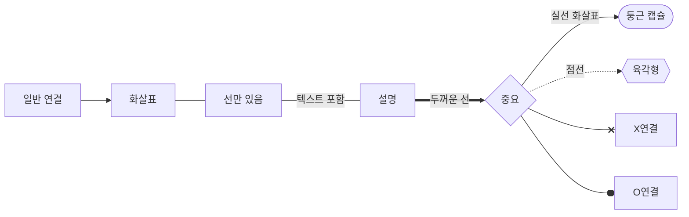
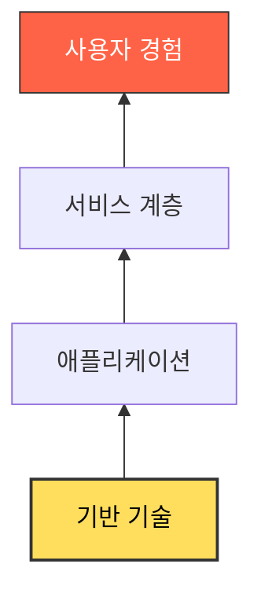
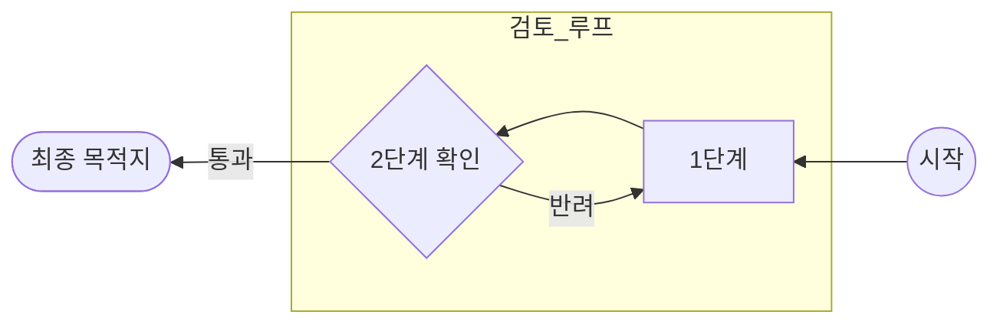

# Mermaid Graph Samples (Ultimate Guide)

이 문서는 Mermaid Flowchart의 4가지 방향 패턴과 주요 기능을 모두 포함한 샘플입니다.

---

## 1. Top Down (TD): 수직 구조 & 서브그래프
복잡한 시스템의 영역을 나누거나 수직적인 흐름을 표현할 때 최적입니다.

---

## 2. Left Right (LR): 수평 구조 & 다양한 연결선
시간의 흐름이나 긴 작업 공정을 표현할 때 가로 폭을 효율적으로 사용합니다.

---

## 3. Bottom Top (BT): 상향식 & 스타일 클래스
역방향 계층 구조나 아래에서 위로 쌓아 올리는 구조를 표현합니다.

---

## 4. Right Left (RL): 우측 시작 구조
오른쪽에서 왼쪽으로 진행되는 특수한 사례에 사용됩니다.

---

## 💡 주요 팁
| 기능 | 예시 | 설명 |
| :--- | :--- | :--- |
| **텍스트 줄바꿈** | `" "` | 노드 안에서 줄바꿈 시 사용 |
| **도형 종류** | `[]`, `()`, `{}` 등 | 사각형, 원형, 다이아몬드 등 다양한 모양 지원 |
| **선 스타일** | `-->`, `-.->`, `==>` | 실선, 점선, 굵은 선 등 표현 가능 |
| **스타일링** | `style` 또는 `classDef` | 특정 노드나 그룹의 색상, 선 굵기 등 커스텀 가능 |
