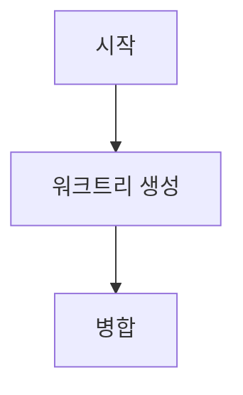
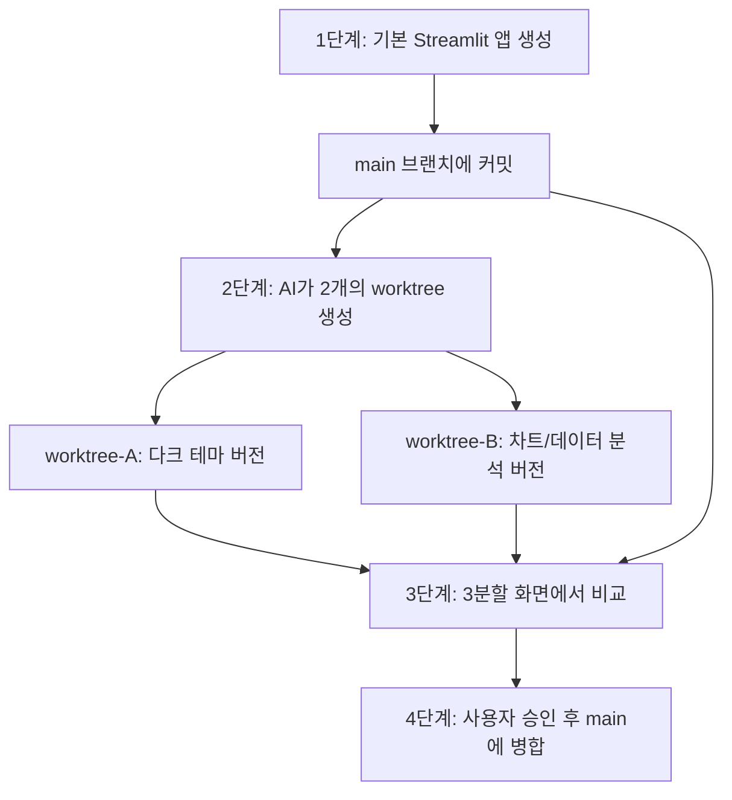

# Git Worktree 가이드 (테스트)

```mermaid
graph TD
    A["시작"] --> B["워크트리 생성"]
    B --> C["병합"]
```

```mermaid
graph TD
    A["1단계: 기본 Streamlit 앱 생성"] --> B["main 브랜치에 커밋"]
    B --> C["2단계: AI가 2개의 worktree 생성"]
    C --> D["worktree-A: 다크 테마 버전"]
    C --> E["worktree-B: 차트/데이터 분석 버전"]
    D --> F["3단계: 3분할 화면에서 비교"]
    E --> F
    B --> F
    F --> G["4단계: 사용자 승인 후 main에 병합"]
```