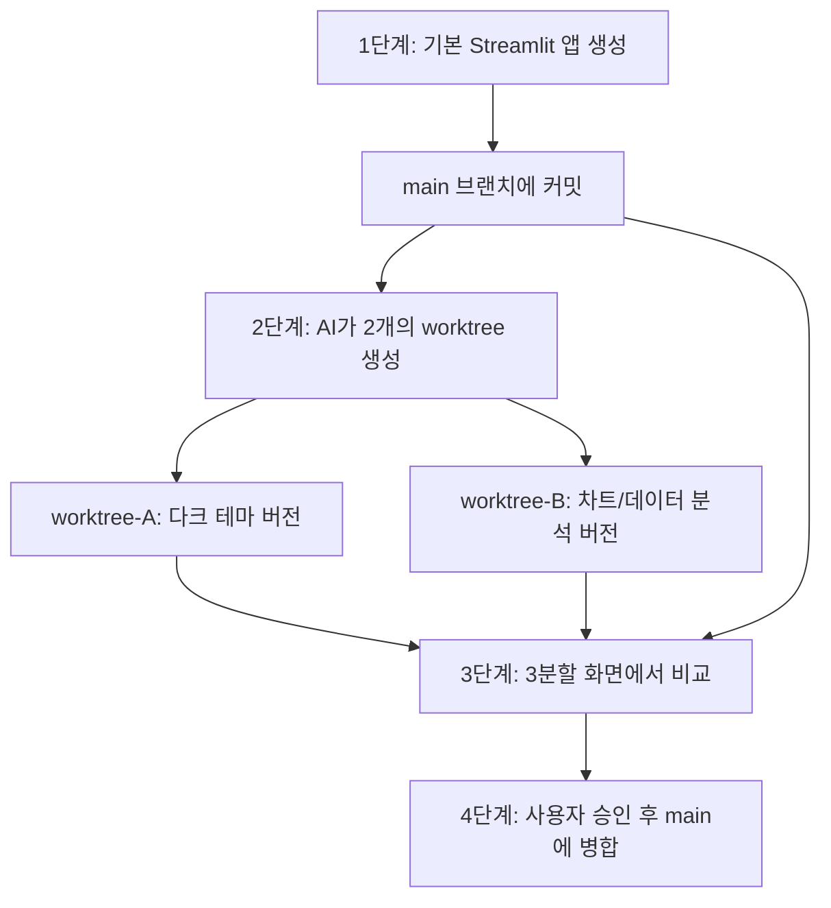

# Git Worktree 데모 프로젝트

AI가 `git worktree`를 활용하여 병렬 개발을 수행하고, 결과를 비교하여 선택적으로 병합하는 전체 워크플로우를 시연합니다.

## 전체 워크플로우 개요



---

## Phase 1: 프로젝트 초기화 & 기본 Streamlit 앱

### 초기화 작업
- Git 저장소 초기화
- Python 가상환경(venv) 생성 & Streamlit 설치
- `.gitignore` 설정

### [NEW] `app.py` — 기본 Streamlit 앱

간단한 대시보드 앱:
- 페이지 타이틀 & 헤더
- 간단한 메트릭 카드 (KPI 3개)
- 기본 라인 차트
- 사이드바 필터

> [!NOTE]
> 이 기본 앱이 **main 브랜치**의 베이스라인이 됩니다. worktree에서 이 파일을 각각 다르게 수정합니다.

---

## Phase 2: Git Worktree 생성 & 병렬 개발

### Worktree A — `feature/dark-theme` 브랜치
경로: `../git-worktree-sample-dark-theme`

수정 내용:
- 다크 테마 스타일 적용 (커스텀 CSS)
- 네온 글로우 효과가 있는 메트릭 카드
- 그라디언트 배경
- 사이드바에 테마 토글 추가

### Worktree B — `feature/analytics` 브랜치
경로: `../git-worktree-sample-analytics`

수정 내용:
- 인터랙티브 Plotly 차트 추가
- 데이터 테이블 추가
- 다운로드 버튼 (CSV export)
- 통계 요약 섹션

---

## Phase 3: 3분할 화면 비교

3개의 Streamlit 앱을 각각 다른 포트에서 동시에 실행:

| 버전 | 포트 | 설명 |
|------|------|------|
| main (기본) | 8501 | 원본 기본 앱 |
| Worktree A (다크 테마) | 8502 | 다크 테마 적용 버전 |
| Worktree B (분석 강화) | 8503 | 차트/분석 강화 버전 |

**비교 뷰어 페이지** (`compare.html`)를 생성하여 3개의 iframe으로 동시에 표시합니다.

---

## Phase 4: 사용자 승인 후 병합

사용자가 선택한 worktree를 main에 병합:

```bash
# 예시: feature/dark-theme를 main에 병합
git merge feature/dark-theme

# worktree 정리
git worktree remove ../git-worktree-sample-dark-theme
git worktree remove ../git-worktree-sample-analytics
```

> [!IMPORTANT]
> 병합은 사용자의 명시적 승인 후에만 진행합니다. 사용자가 원하는 브랜치(또는 둘 다)를 선택할 수 있습니다.

---

## 파일 구조

```
git-worktree-sample/          # main 브랜치 (원본)
├── .gitignore
├── requirements.txt
├── app.py                     # 기본 Streamlit 앱
└── compare.html               # 3분할 비교 뷰어

../git-worktree-sample-dark-theme/   # Worktree A
└── app.py                           # 다크 테마 버전

../git-worktree-sample-analytics/    # Worktree B
├── app.py                           # 분석 강화 버전
└── requirements.txt                 # plotly 추가 의존성
```

---

## Verification Plan

### 자동 검증
1. 3개의 Streamlit 앱이 각각 다른 포트에서 정상 실행되는지 확인
2. `compare.html`에서 3분할 화면이 정상 표시되는지 브라우저로 확인
3. `git worktree list`로 worktree 목록 확인
4. `git log --all --graph --oneline`으로 브랜치 구조 확인

### 수동 검증
- 사용자가 3개의 결과물을 비교하고 병합할 브랜치를 선택
